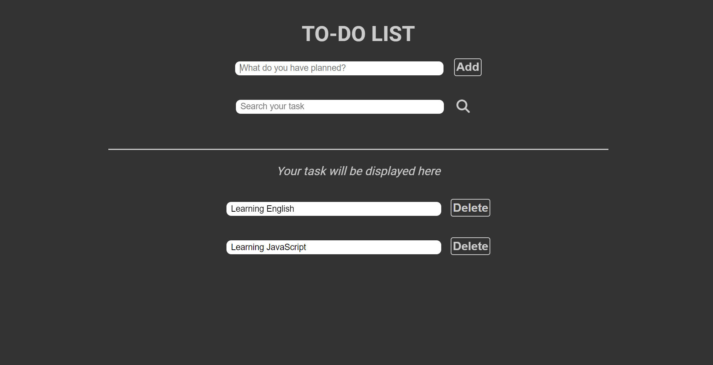

# Simple-To-do-List-Website

## Introduction
This is a simple To-do list made in HTML, CSS and JavaScript.
The website has some function: Add a task, delete a task, and edit a task.  
The website don't use local storage to store the data, so all tasks will be deleted if you reload the page.

## Interface of the website
There are some demos of the website:  
* The tab website:  
  
* The interface:  

## To see the website fully
Download all files of this project (except the readme file and readme-img folder). Open index.html file and you can see the full website. Or you can visit the website by clicking [HERE](https://simpletodolistwebsite.netlify.app)

 

